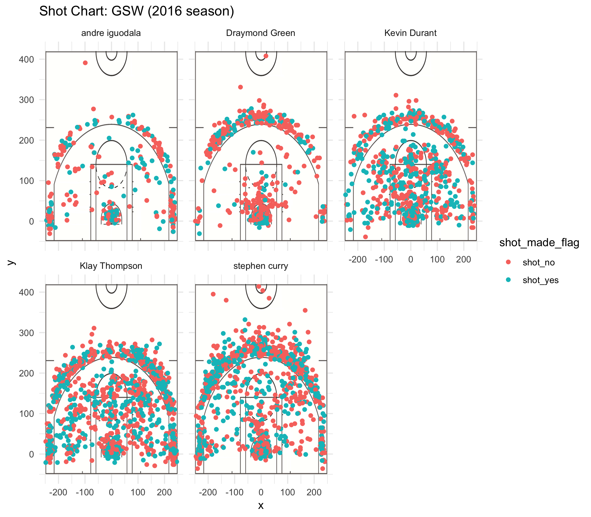

Workout 1
================
Yiyang Jin

Introduction:
-------------

The NBA 2017 season is about to begin, and Golden State Warriors, one of the strongest competitors for the champion, is getting ready for its new season. As the strongest team in the NBA league, Golden State Warriors has some of the best players in the league, like Stephen Curry and Kevin Durant, who have a very strong ability of score points. At this time when the 2017 NBA season is about to start, I am writing the report to analyze the personal abilities, especially shooting abilities of the starters of the Golden State Warriors to give you a deeper understanding of the team.

Background:
===========

Here is some background information of the star players in Golden State Warriors:

-   Stephen Curry, the passing guard, is definitely the best player in this position in the past few seasons. He led the Warriors to win the champion of the 2014 and 2016 NBA games, and he was honored the MVP of the regular season in the 2014 and 2015 NBA season. His best weapon to score is three-point shooting, and Curry is actually leading the new trend of three-point shooting in the NBA league. Curry not only has a strong ability for 3-point shots, but he is also very good at assisting teammates to score. As the top player of the team curry is definitely going to lead the top to chase a good score in the new season.

-   Kevin Durant, the small front, is another talented player, and he is regarded as the player with the best ability to score points in the post-Jordan era. He scored the most points in the league in the 2010 season, when he was only 21 years old. He was also the FMVP of the 2016 season, which is an award for his outstanding performance in the finals. Durant has various ways to score points, and it seems he is able to score at any part of the pitch, from outside the three-point line to inside the paint. He is very good at almost every way to score: layups dunks and shots from distance.

-   Klay Thompson, the shooting guard, is another all-star player who has a very strong ability to make three-point shots. His accurate three-point shots make him another great scorer in the team. Thompson has records like scoring 37 points within a single period and scoring 60 points in 29 minutes. Apart from his three-point shots, Thompson is also good at defense. Thompson contributes a lot to the defensive system of the Warriors.

-   Draymond Green, the power front of the team, also plays an important role in the Warriors. Although Green does not score as many points as the three players above, the role Green plays within the team is even more important. Green’s rebounding and assisting ability allows the team function more fluently. People often say Green is like the lubricant of the Warriors. Green also plays an important defensive role, and he is awarded the Defensive Player of the Year in the 2016 season.

-   Andre Iguodala, the small front, was awarded the FMVP in the 2014 NBA season. Iguodala is very strong physically, and this allows him to be an all-around player. Iguodala has some ability to score, and he plays a more important role in defense: his defense against Lebron James is regarded as an important reason that Warriors could defeat the Cavaliers.

Data:
-----

``` r
library(dplyr)
```

    ## 
    ## Attaching package: 'dplyr'

    ## The following objects are masked from 'package:stats':
    ## 
    ##     filter, lag

    ## The following objects are masked from 'package:base':
    ## 
    ##     intersect, setdiff, setequal, union

``` r
shots = read.csv("../data/shots-data.csv", stringsAsFactors = FALSE)
name = c("Andre Iguodala", "Stephen Curry", "Kevin Durant", "Klay Thompson", "Draymond Green")
total = c(sum(shots$name == "andre iguodala"), sum(shots$name == "stephen curry"), sum(shots$name == "kevin durant"), sum(shots$name == "klay thompson"), sum(shots$name == "draymond green"))
total
```

    ## [1]  371 1250  915 1220  578

``` r
table = cbind(name,total)
made = c(sum(shots$name == "andre iguodala" & shots$shot_made_flag == "shot_yes"), sum(shots$name == "stephen curry" & shots$shot_made_flag == "shot_yes"), sum(shots$name == "kevin durant" & shots$shot_made_flag == "shot_yes"), sum(shots$name == "klay thompson" & shots$shot_made_flag == "shot_yes"), sum(shots$name == "draymond green" & shots$shot_made_flag == "shot_yes"))
perc_made = made/total
table_effective = arrange(data.frame(name = name, total = total, made = made, perc_made = perc_made, stringsAsFactors = FALSE),
                          desc(perc_made))
table_effective
```

    ##             name total made perc_made
    ## 1   Kevin Durant   915  495 0.5409836
    ## 2 Andre Iguodala   371  192 0.5175202
    ## 3  Klay Thompson  1220  575 0.4713115
    ## 4  Stephen Curry  1250  584 0.4672000
    ## 5 Draymond Green   578  245 0.4238754

From the table of the effective shooting percent by player, we can find out that Kevin Durant has the highest shooting percentage of 54.1%. Iguodala has the second highest percentage of 51.8%. Then is Thompson with a 47.1% of chance to make a shot. Then curry has a little lower shot percentage than Thompson’s, which is 46.7%. Green has the lowest shooting percentage of 42.4%. Also, we can see that Thompson and Curry have above 1200 totals, and Durant has 915 total shots. Green has only 578 total shots, and Iguodala has the least of 371 total shots.

``` r
total2 = c(sum(shots$name == "andre iguodala" & shots$shot_type == "2PT Field Goal"), sum(shots$name == "stephen curry" & shots$shot_type == "2PT Field Goal"), sum(shots$name == "kevin durant" & shots$shot_type == "2PT Field Goal"), sum(shots$name == "klay thompson" & shots$shot_type == "2PT Field Goal"), sum(shots$name == "draymond green" & shots$shot_type == "2PT Field Goal"))
made2 = c(sum(shots$name == "andre iguodala" & shots$shot_made_flag == "shot_yes" & shots$shot_type == "2PT Field Goal"), sum(shots$name == "stephen curry" & shots$shot_made_flag == "shot_yes" & shots$shot_type == "2PT Field Goal"), sum(shots$name == "kevin durant" & shots$shot_made_flag == "shot_yes" & shots$shot_type == "2PT Field Goal"), sum(shots$name == "klay thompson" & shots$shot_made_flag == "shot_yes" & shots$shot_type == "2PT Field Goal"), sum(shots$name == "draymond green" & shots$shot_made_flag == "shot_yes" & shots$shot_type == "2PT Field Goal"))
perc_made2 = made2/total2  
table_2_effective = arrange(data.frame(name = name, total = total2, made = made2, perc_made = perc_made2, stringsAsFactors = FALSE), desc(perc_made))
table_2_effective
```

    ##             name total made perc_made
    ## 1 Andre Iguodala   210  134 0.6380952
    ## 2   Kevin Durant   643  390 0.6065319
    ## 3  Stephen Curry   563  304 0.5399645
    ## 4  Klay Thompson   640  329 0.5140625
    ## 5 Draymond Green   346  171 0.4942197

We can then look at the table of effective shooting percentages of two-point shots. In the case of two-point shots, Iguodala has a pretty high percentage of 63.8% of making a two-point shot. Then Durant also has a pretty high percentage of 60.6% to make two-point shots. Curry and Thompson have a slightly lower percentage of 2-point shots. Curry has a 54.0%, and Thompson has a percentage of 51.4%. Green again, has the lowest percentage of 49.4%，but it is not too low. Although Iguodala has a very high percentage of making a shot, he only has 210 tries, which is much lower than the other players. Durant and Thompson both have above 640 total two-point tries. Curry has 563 tries and Green has 346 tries.

``` r
total3 = c(sum(shots$name == "andre iguodala" & shots$shot_type == "3PT Field Goal"), sum(shots$name == "stephen curry" & shots$shot_type == "3PT Field Goal"), sum(shots$name == "kevin durant" & shots$shot_type == "3PT Field Goal"), sum(shots$name == "klay thompson" & shots$shot_type == "3PT Field Goal"), sum(shots$name == "draymond green" & shots$shot_type == "3PT Field Goal"))
made3 = c(sum(shots$name == "andre iguodala" & shots$shot_made_flag == "shot_yes" & shots$shot_type == "3PT Field Goal"), sum(shots$name == "stephen curry" & shots$shot_made_flag == "shot_yes" & shots$shot_type == "3PT Field Goal"), sum(shots$name == "kevin durant" & shots$shot_made_flag == "shot_yes" & shots$shot_type == "3PT Field Goal"), sum(shots$name == "klay thompson" & shots$shot_made_flag == "shot_yes" & shots$shot_type == "3PT Field Goal"), sum(shots$name == "draymond green" & shots$shot_made_flag == "shot_yes" & shots$shot_type == "3PT Field Goal"))
perc_made3 = made3/total3
table_3_effective = arrange(data.frame(name = name, total = total3, made = made3, perc_made = perc_made3, stringsAsFactors = FALSE), desc(perc_made))
table_3_effective
```

    ##             name total made perc_made
    ## 1  Klay Thompson   580  246 0.4241379
    ## 2  Stephen Curry   687  280 0.4075691
    ## 3   Kevin Durant   272  105 0.3860294
    ## 4 Andre Iguodala   161   58 0.3602484
    ## 5 Draymond Green   232   74 0.3189655

Looking at the table of effective shooting percentages of three-point shots, we find out that Thompson has the highest percentage of making a three-point shot, which is 42.4%. Curry, Durant ,and Iguodala each have 40%, 38% and 36% chance to make a two-point-shot. Again, Draymond Green has the lowest percentage of 31.9 percent. And the number of total three-point shots attempts made is interesting. Curry apparently has the largest number of 687 tries. Thompson also has 580 attempts, which is pretty high. Durant and Green have much fewer attempts than Curry and Thompson, and Iguodala again has the least number of attempts.  The shot charts of the players also provide a lot of information. For the shot charts, each point on the chart represents the position of the shot made on the court, and the color of the point represents whether the shot is made or not. The bluish-green color stands for a made shot, and the red color represents a missing shot. These charts provide very similar information we observed from the percentage of three-point shots among all shots. It is obvious that curry has the largest number of shots from outside the three-point line, and it seems he tries most of his shots in the range around the top of the circle. Thompson also has many three-point shot attempts, and it seems his attempts spread more evenly throughout the whole three-point line. And Thompson certain shoot more middle range shots than curry does. Durant, on the other hand, has much fewer three-point attempts, and we can observe that he has a pretty high percentage of making middle range shots and layups. Green seems to choose either three-point shots or layups inside the paint. However, Green seems to miss a lot of his shots, and he has a lower percent of shot success of either inside the paint or outside the three-point line than Durant, Thompson and, Curry. Iguodala certainly has the least number of shots, but he has a pretty good percentage of making them.

``` r
three_point_in_total = c(sum(shots$name == "andre iguodala" & shots$shot_type == "3PT Field Goal"), sum(shots$name == "stephen curry" & shots$shot_type == "3PT Field Goal"), sum(shots$name == "kevin durant" & shots$shot_type == "3PT Field Goal"), sum(shots$name == "klay thompson" & shots$shot_type == "3PT Field Goal"), sum(shots$name == "draymond green" & shots$shot_type == "3PT Field Goal")) / c(sum(shots$name == "andre iguodala"), sum(shots$name == "stephen curry"), sum(shots$name == "kevin durant"), sum(shots$name == "klay thompson"), sum(shots$name == "draymond green"))
three_point_in_total_df = data.frame(name, three_point_in_total)
arrange(three_point_in_total_df, desc(three_point_in_total))
```

    ##             name three_point_in_total
    ## 1  Stephen Curry            0.5496000
    ## 2  Klay Thompson            0.4754098
    ## 3 Andre Iguodala            0.4339623
    ## 4 Draymond Green            0.4013841
    ## 5   Kevin Durant            0.2972678

Another very interesting set of data to look at is the percentage of three-point attempts in all shot attempts. It is easy to observe that Curry has the highest percentage of three-point shots in all his shots, which is 55.0% percent. More than half of curry’s attempt is from outside of the three-point line. Then Thompson has a 47.5% percent of all his attempts as three-point shots. Iguodala and Green each have a percentage of 43.4% and 40,1% of shooting a three-point shot. Durant, unlike his teammates, has a much lower percentage of shooting three-point shots. Durant only shoots 29.7% of his total attempts as three-point shots.

Analysis & Discussion:
----------------------

-   For Stephen Curry, we find that he really likes to shoot three-point balls, and he is the only one who makes more three-point attempts than two-point attempts. That answers the question why Curry’s total effective percentage of making shots is about 7% lower than Durant’s, as Curry 55% of the total attempts from Curry is three-point shots, while that is only 30% for Durant. Curry has a pretty high 40.7% chance of making a three-point shot, and this makes his choice of shooting a lot of three-point balls reasonable. From the shot chart, we can observe that curry makes most of his three-point attempts around the top of the circle, and he does make a lot of those shots from there. Curry is the player with the most total attempts within the team, and this suggests he is the core player of the team, and his three-point shots it going be a threat for other teams.

-   For Klay Thompson, he makes about the same number of three-point attempts and two-point attempts. Thompson has the highest percentage of making a three point shot of 42.4%, but his two-point shots are less accurate and only ranks number four among the five with a percentage of 51.4%. From the chart, we find out Thompson’s three-point shots spread all along the three-point line, and it seems he is capable of making three-point shots at any position. This suggests Thompson is a great three-point shooter. Considering his high three-point percentage and not so high two-point percentage, we would suggest Thompson try more three-point shots as Curry does, which might help him to be a more efficient scorer and score more points.

-   For Kevin Durant, he has the highest total shot percentage of 54.1%, and this indicates he is very good at scoring. Durant has a pretty high 60.6% percentage of making two-point shots, and his three-point percentage, though not as high as Curry’s or Thompson’s, is still a pretty high 38.6%. 70% of Durant’s total shots are three-point attempts, and only 30% percent of his total attempts are for two-points. We can easily observe that Durant has a different style of playing from Curry or Thompson. It seems Durant likes to get inside the paint and do layups and dunks and shot middle range shots rather than shooting-point shots. That different style is actually pretty important for the Warriors. If all three star players of Warriors like to shot outside the three-point line, other teams can adopt a straightforward defense strategy of guarding three-point shots. Thus this different style of scoring making Warrior’s offense more dynamic and vibrant, and it is even harder for other teams to defend.

-   For Andre Iguodala, we find out he has pretty high shooting percentages, especially for two-point shots. However, Iguodala has the least number of attempts for either two-point shots or three-point shots. Considering his high two-point shot percentage of 63.8%, his team teammate could give Iguodala more chance of shooting two-point shots. It is interesting to look at the shot chart of Iguodala and find out that he has a much higher percentage of success of making shots on the right half of the court than on the left half. He might consider practicing more to shoot on the left half so that he can be a more balanced player.

-   For Draymond Green, we find that he has the lowest percentage of both three-point shots and two-point shots. And from the shot chart, we find out Green’s attempts are limited to either three-point shots or layups and shots inside the paint, and there are very few attempts of middle range shots. We would suggest Green practice more middle range shots so that his strategies to score are not as limited. But Green’s lower shooting percentage does not mean he is not an important player in Warrior’s offense. These shot data fails to show Green’s ability to assist and to fight for offensive rebounds. As mentioned in the background section, Green is the one who threads the team together, and he is an indispensable part of the team. But if he can make shooting more accurately, the Warriors is certainly going to be even more competitive and undefeatable.

Take Home Message:
------------------

We did a simple analysis of the shooting percentages of the starter of the Golden State Warriors. We find out that Stephen Curry and Klay Thompson are both great three-point shooters, and their three-point shots are definitely a great threat for other teams. Kevin Durant is another player with a very strong scoring capacity, and he masters all different ways to score. His style, different from Curry and Thompson, makes the offense of the Warriors more dynamic, and how to guard Durant certainly is a great problem for other teams. Andre Iguodala has pretty good shooting percentages, but he apparently does not shoot a lot, thus we suggest he could try to shoot more frequently and turning high shooting percentages into more point. And Draymond Green has the lowest shooting percentages among all these five players, and his way to score is limited to three-point shots and close range shots inside the paint. We suggest Green could practice more middle range shots to make himself a better scorer.

Reference
---------

<https://on.nba.com/2Vv1t2u>

<https://bit.ly/2HcDJMD>

<https://bit.ly/2BWTmoc>

<https://bit.ly/2EnDkUD>
